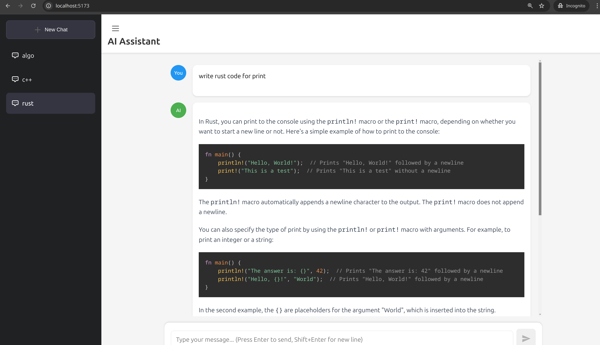

# Llamalog: AI Chat Application with Llama.cpp

A full-stack chat application featuring a modern web interface built with Svelte and a Python backend that integrates with llama.cpp for AI model inference. The application supports continuous conversations, markdown rendering, code highlighting, and math equations.



## Features

- 🚀 Real-time streaming responses
- 💬 Continuous conversation with context memory
- 📝 Markdown support with syntax highlighting
- ➗ LaTeX math equation rendering
- 📋 Code block copying
- 🗂️ Chat session management
- 💾 SQLite database for conversation history
- 🎨 Clean, responsive UI

## Architecture

- Frontend: Svelte + Vite
- Backend: FastAPI
- AI Model: llama.cpp
- Database: SQLite

## Prerequisites

- Python 3.12+
- Node.js 18+
- llama.cpp server running locally
- A compatible LLM model for llama.cpp

## Installation

### 1. Clone the repository

```bash
git clone https://github.com/Qervas/Llamalog.git
cd Llamalog
```

### 2. Set up llama.cpp

First, you need to have llama.cpp installed and running:

```bash
# Clone llama.cpp repository
git clone https://github.com/ggerganov/llama.cpp
cd llama.cpp

# Build the project
cmake -B build -DGGML_CUDA=ON
cmake --build build --config Release

# Download or provide your own model
# Example with a compatible model:
wget https://huggingface.co/bartowski/Llama-3.2-3B-Instruct-GGUF/resolve/main/Llama-3.2-3B-Instruct-f16.gguf

# Start the server (adjust parameters as needed)
./build/bin/llama-server -m models/Llama-3.2-3B-Instruct-f16.gguf
```

### 3. Set up the Python Backend

```bash
# Create and activate virtual environment in the root directory
python -m venv .venv
source .venv/bin/activate  # On Windows: .\venv\Scripts\activate

# Install dependencies
pip install -r backend/requirements.txt

# Start the backend server

cd backend
uvicorn main:app --reload
```

### 4. Set up the Frontend

```bash
# Navigate to the frontend directory
cd my-chat-app

# Install dependencies
npm install

# Start the development server
npm run dev
```

## Configuration

### Backend Configuration

The backend server configuration can be modified in `main.py`:

```python
# Database configuration
DATABASE_URL = "sqlite:///./chat_history.db"

# Model configuration
LLAMA_CPP_SERVER = "http://127.0.0.1:8080"
MAX_TOKENS = 2048
TEMPERATURE = 0.7
```

### Frontend Configuration

The frontend configuration can be modified in `my-chat-app/src/App.svelte`:

```javascript
// API endpoint configuration
const API_BASE_URL = "http://localhost:8000";
```

## Usage

1. Start the llama.cpp server with your chosen model
2. Start the Python backend server
3. Start the frontend development server
4. Open your browser and navigate to `http://localhost:5173`

### Basic Operations

- **New Chat**: Click the "New Chat" button to start a new conversation
- **Send Message**: Type your message and press Enter or click the send button
- **Browse History**: Use the sidebar to navigate between different chat sessions
- **Rename Chats**: Double-click on a chat title to rename it
- **Delete Chats**: Click the delete icon next to a chat session

### Keyboard Shortcuts

- `Enter` - Send message
- `Shift + Enter` - New line in message
- `Esc` - Cancel chat title editing

## Development

### Project Structure

```
├── my-chat-app/           # Frontend application
│   ├── src/
│   │   ├── App.svelte    # Main application component
│   │   ├── lib/          # Shared components
│   │   └── main.js       # Application entry point
│   ├── public/           # Static assets
│   └── package.json      # Frontend dependencies
└────── backend/
    ├── main.py           # Backend server
    ├── db_models.py      # Database models
    └── chat_history.db   # SQLite database
```

### Customization

- **Styling**: Modify the CSS in `App.svelte` and `Markdown.svelte`
- **Markdown**: Customize markdown rendering in `lib/Markdown.svelte`
- **Model Parameters**: Adjust the model parameters in `main.py`

## Contributing

Contributions are welcome! Please feel free to submit a Pull Request.

## License

[MIT License](LICENSE)

## Acknowledgments

- [llama.cpp](https://github.com/ggerganov/llama.cpp)
- [Svelte](https://svelte.dev)
- [FastAPI](https://fastapi.tiangolo.com)
